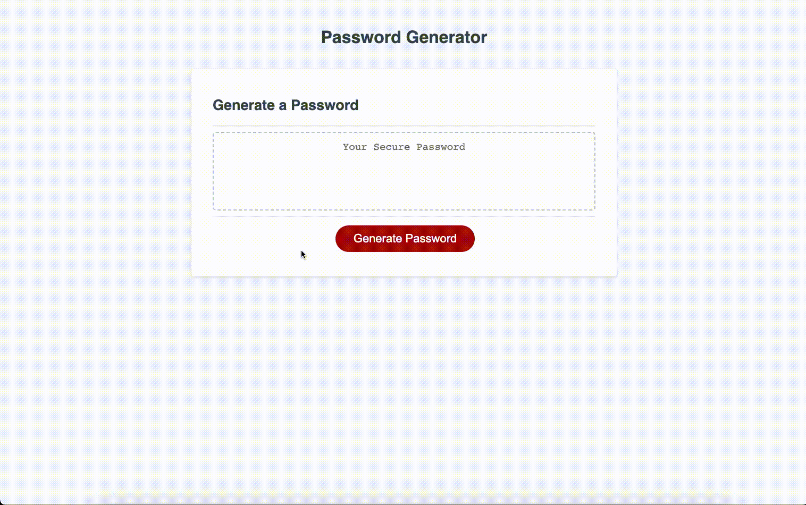

# Password Generator Build

The purpose of this build is to create a password generator that prompts the user with confirm boxes to determine criteria for a password and then generates a random password in the text box. 

## Installation

No installation necessary. 

## Visual

## Usage

Public use for informational purposes only. 

## Link

[Build-Password Generator](https://softpoachedeggs.github.io/build-password-generator/)

## License

[MIT](https://choosealicense.com/licenses/mit/)
